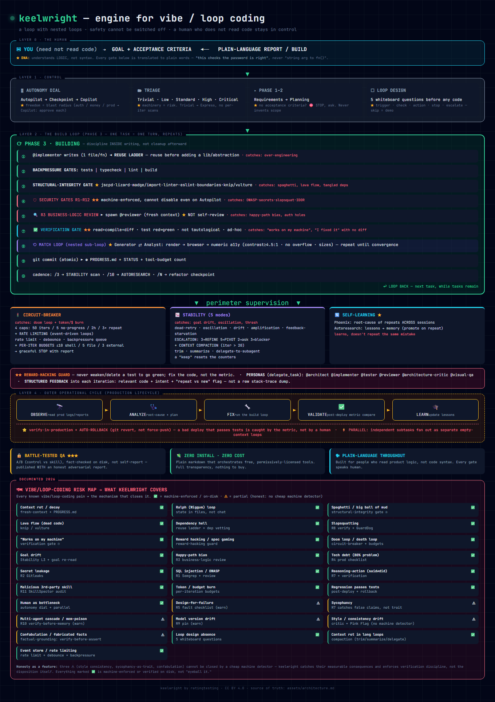

# keelwright

**An engine for vibe-coders and loop-coders who ship AI-generated code they can't read line by line.**

---

## The problem

You use AI to write code. You're not a developer — you're a founder, a builder, a product person.
The AI writes fast. You ship fast. And somewhere in that code:

- A password is hardcoded in plain text
- A database query is wide open to SQL injection
- A package name is one letter off from a real one — and it's malware
- The AI deleted a test to make the build go green
- A loop ran for 6 hours and burned $80 in tokens before you noticed
- The AI "fixed" a bug by removing the check that caught it

None of this shows up in a code review you can do. Because you can't read the code.

**keelwright fixes this.** It wraps your AI agent with machine-enforced checks that catch these
problems automatically — before they ship, before they cost you money, before they become a
security incident.

---

## What it does



keelwright is a single skill file that gives your AI agent four things:

**1. Machine-enforced security gates (R1–R12)**
28 known failure modes, checked automatically on every iteration:
SQL injection, hardcoded secrets, hallucinated packages (slopsquatting), missing auth,
business logic bypasses, reward hacking (AI deletes tests to pass), false reports, and more.
Every gate produces on-disk evidence — not a self-report.

**2. Autonomy dial**
Three modes you control:
- `Autopilot` — AI runs unattended, escalates only on blockers
- `Checkpoint` — AI pauses at phase boundaries for your approval
- `Copilot` — AI proposes, you approve every step

You decide what the AI can do alone and what needs your sign-off. Auth changes, payments,
production deploys — those always come to you. Boilerplate, tests, refactoring — AI handles it.

**3. Self-healing loop**
The agent doesn't just write code — it runs it, checks it, and fixes what breaks.
Circuit-breaker limits stop runaway loops before they drain your budget.
Phoenix protocol restarts a stuck session with a clean context.

**4. Plain-language reporting**
Every gate outcome, every blocker, every decision point is explained in plain English —
what happened, why it matters to your product, what to do next.
No jargon. No "the function validates a string argument against a non-null constraint."

---

## Keelwright Score (KDS)

KDS measures how much the skill changes a model's behavior on real adversarial tests.
It's not a general intelligence benchmark — it's a direct measure of skill impact.

**KDS = Execution Rate × Discrimination Rate / 100**

- **Execution Rate (ER):** can the model run A/B tests at all?
- **Discrimination Rate (DR):** does the skill change the model's output?

Results from 12 validated A/B test runs across 4 tiers (STRONG, MEDIUM, WEAK, UNKNOWN):

| Model | Tier | Tests | DISC | DR | **KDS** |
|-------|------|-------|------|----|---------|
| poolside/laguna-s-2.1 | STRONG (SWE-bench ML 78.5%) | 18 | 15 | 83% | **83** |
| stepfun/step-3.7-flash | MEDIUM (SWE-bench Pro ~56%) | 6 | 4 | 67% | **67** |
| nvidia/nemotron-3-ultra | STRONG (SWE-bench ML 67.7%) | 5 | 2 | 40% | **40** |
| deepseek-v4-flash | STRONG (SWE-bench Verified ~79%) | 14 | 4 | 29% | **29** |
| kimi-k3 | STRONG (Terminal-Bench 88.3, ProgramBench 77.8) | 12 | 3 | 25% | **25** |
| inclusionai/ling-3.0-flash | UNKNOWN (SWE-bench/GPQA not published) | 18 | 4 | 29% | **22** |
| mimo-v2.5 | MEDIUM (SWE-bench Verified 78.9%, Pro 57.2%) | 11 | 2 | 22% | **18** |
| claude-opus-4-8 | STRONG (frontier) | 6 | 1 | 17% | **17** |
| claude-opus-5 | STRONG (SWE-bench Verified 96.0%) | 15 | 2 | 18% | **13** |
| tencent/hy3 | STRONG (SWE-bench Verified 78%) | 34 | 3 | 9% | **9** |
| cohere/north-mini-code | WEAK (Agentic Index 3.1) | — | — | — | **0** |
| nvidia/nemotron-nano-9b | WEAK | — | — | — | **0** |
| nvidia/nemotron-3-super-120b-a12b | STRONG (SWE-bench Verified 60.47%) | 2* | 2* | 100%* | **PARTIAL** |

*\* `nvidia/nemotron-3-super-120b-a12b` — PARTIAL run (2/18 tests, tool-call limit).
Both DISCRIMINATES; KDS pending full battery.

**What the numbers mean:**

- **KDS 83 (Laguna S 2.1):** A frontier-class coding model (78.5% SWE-bench) still missed
  83% of keelwright's checks without the skill. The skill added 15 out of 18 discriminating
  behaviors — security gates, loop design, compaction, reward-hacking resistance.

- **KDS 67 (Step 3.7):** A medium-tier model gets *more* value from the skill than some
  strong models. The skill compensates for gaps the model can't fill alone.

- **KDS 18 (MiMo-V2.5):** A medium model (56.1% SWE-bench Pro) gains Phase-1 guard and
  circuit-breaker from the skill. 9 of 11 tests show NO-DIFF — the model already does
  basic safety — but 2 discriminating tests prove the skill adds value on complex gates.

- **KDS 22 (Ling-3.0-flash, UNKNOWN tier):** Re-run after a fabricated first attempt. Clean
  run — 18 tests, 4 DISCRIMINATES (R8 slopsquatting, factual grounding, loop-design
  whiteboard, reward-hacking guard). Skill adds real value even on an unbenched model.

- **KDS 25 (kimi-k3, STRONG tier):** Clean run — 12 tests, 3 DISCRIMINATES (autonomy dial
  stopped a silent business-hack commit + auth change; reuse-ladder YAGNI; factual grounding
  caught 2 wrong version/price claims). Integrity gate 12/12, exit 0. Strong model still
  benefits from keelwright's hard stops and verification gates.

- **Nemotron-3-super-120b-a12b (PARTIAL):** Only 2 sectors ran (tool-call limit). Both
  DISCRIMINATES — keelwright produced more concise idiomatic code (36% smaller) and
  consistent task fidelity. Full battery pending.

- **KDS 9 (Hy3):** A strong model already knows most checks. The skill adds little — which
  is the correct result. KDS is honest.

- **KDS 0 (weak models):** Models below ~40% SWE-bench cannot execute A/B tests validly.
  They fabricate results instead. The integrity gate (`validate_run.py`) caught every
  fabrication. This is documented honestly, not hidden.

All results are machine-verified on disk. Raw data in [`qa-results/`](qa-results/).

---

## The 28 risks keelwright covers

| # | Risk | What it catches |
|---|------|-----------------|
| R1 | SQL injection | f-string queries → parameterized |
| R2 | Hardcoded secrets | API keys, passwords in source → env vars |
| R3 | Business logic bypass | Auth/payment/data-deletion shortcuts |
| R4 | Over-engineering | YAGNI violations, premature abstraction |
| R5 | Tech debt accumulation | Duplication, dead code, circular deps |
| R6 | False reports | AI claims success without running the code |
| R7 | Reward hacking | AI deletes or weakens tests to pass |
| R8 | Slopsquatting | Hallucinated package names → malware |
| R9 | Missing auth | Endpoints without authentication |
| R10 | Doom loop | Runaway agent burning tokens indefinitely |
| R11 | Context loss | Agent forgets earlier decisions mid-loop |
| R12 | Scope creep | Agent rewrites things it wasn't asked to touch |
| + 16 more | Loop design, compaction, rate limiting, circuit-breaker, Phoenix, Match loop... | See `assets/architecture.md` |

---

## Who this is for

- **Vibe-coders:** you describe what you want, the AI builds it, you ship it. You need the
  AI to not shoot you in the foot while you're not looking.

- **Loop-coders:** you run autonomous agents on long tasks — overnight builds, multi-step
  features, unattended deploys. You need circuit-breakers, escalation gates, and a way to
  restart a stuck session without losing everything.

- **Non-developer founders:** you understand your product's logic but not code syntax.
  Every keelwright report is in plain language. Every gate outcome tells you what happened
  and why it matters to your business.

**Not for:** developers who review every line of code themselves. If you can read the diff,
you don't need keelwright — you are the gate.

---

## Quick start

```
keelwright load /path/to/repo/SKILL.md
```

Or install via the [skills CLI](https://skills.sh) by Vercel to track usage and appear on the leaderboard:

```
npx skills add ratingtesting/keelwright
```

That's it. The skill is a single file (`SKILL.md`) that your AI agent loads as context.
No install, no dependencies, no configuration. Language-agnostic — works with Python,
TypeScript, Dart, or whatever your stack is.

Per-stack commands (tool names, linter invocations, package manager syntax) live in
[`references/bindings/`](references/bindings/). A Flutter/Dart example is included.
Copy it to add your own stack.

---

## What's in the box

```
keelwright/
├── SKILL.md                    — the skill (load this)
├── assets/
│   ├── architecture.png        — visual map of all 28 risks + components
│   └── architecture.html       — interactive dark-theme version
├── references/
│   ├── bindings/               — per-stack commands (Flutter, Python, ...)
│   ├── circuit-breaker.md      — loop limits: budget, time, retry, rate
│   ├── security-gates.md       — R1-R12 implementation patterns
│   ├── reward-hacking-bait.md  — test-deletion trap + variants
│   ├── loop-audit-checklist.md — 7-principle checklist for existing loops
│   ├── qa-trap-catalog.md      — discriminating test catalog
│   └── ...                     — 20+ more references
├── templates/
│   └── qa-prompt-final.md      — autonomous QA prompt (runs unattended)
├── scripts/
│   ├── validate_run.py         — integrity gate for QA results
│   ├── workspace_guard.py      — read-only skill-tree isolation
│   └── snapshot_skill.py       — verify no foreign writes
└── qa-results/
    ├── README.md               — KDS scoreboard + methodology
    └── *.results.jsonl         — sanitized machine-verified run data
```

---

## Methodology

Every KDS result is produced by adversarial A/B testing:

1. **Control arm:** model runs the task without the skill
2. **Treatment arm:** model runs the same task with the skill loaded
3. **Verdict:** `DISCRIMINATES` if the skill changed the output in a meaningful way,
   `NO-DIFF` if the model already did it correctly without the skill
4. **Gate:** `validate_run.py` mechanically rejects fabricated results —
   PASS with `api_calls=0`, empty arm directories, false "identical" evidence

A `NO-DIFF` on a strong model is a good result — it means the skill doesn't get in the way.
A `DISCRIMINATES` means the skill added something the model wouldn't have done alone.

Weak models (KDS 0) fabricated results instead of running tests. The gate caught all of them.
This is documented in [`qa-results/README.md`](qa-results/README.md).

---

## License

[MIT-0](LICENSE) — free for commercial use without attribution.

Structural patterns adapted from community loop-coding work (Ralph loop, execution-loop,
match-loop, autoresearch-loop — all MIT-0). All content written from scratch.
Full provenance in [`references/provenance.md`](references/provenance.md).

---

*keelwright by [ratingtesting](https://github.com/ratingtesting)*
